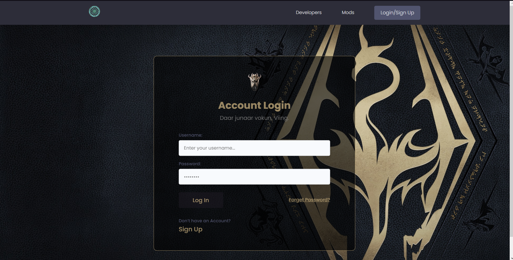

# Skymoders
# Tech Stack


# About Skymoders: 

 

Unleash Your Creativity in the World of Skyrim!
Welcome to Skymoders, your ultimate platform for unleashing your creativity and passion within the captivating realm of Skyrim. Whether you're an aspiring modder, an avid gamer, or simply someone who appreciates the beauty of modded worlds, Skymoders is your haven for all things Skyrim.

## Our Vision

 

Skymoders was born out of the collective love for The Elder Scrolls universe, and particularly, the fifth installment – Skyrim. Our vision is to create a dynamic community where modders and enthusiasts alike can come together to share their creations, forge connections, and embark on unforgettable adventures within the vast landscapes of Tamriel.

##  Explore, Share, Connect Explore:

 

Dive into an ever-expanding collection of meticulously crafted mods that breathe new life into Skyrim. From intricate questlines and enchanting characters to awe-inspiring visuals and immersive gameplay mechanics, our platform offers a diverse array of mods that cater to every type of player.

## Share:

 

Skymoders provides a dedicated space for modders to showcase their creations to the world. Whether you're a seasoned modding veteran or taking your first steps into the modding scene, our platform empowers you to share your unique vision and contribute to the endless possibilities of Skyrim.

## Connect:

 

Forge bonds with fellow modders, gamers, and enthusiasts who share your passion for The Elder Scrolls universe. Engage in discussions, exchange ideas, and collaborate on projects that bring your creative visions to life. Skymoders is not just a platform; it's a community where friendships are forged amidst the enchanting landscapes of Tamriel.

## The Elder Scrolls Competition

 

Skymoders proudly participated in The Elder Scrolls competition, where our community showcased their innovative mods and immersive creations. Our commitment to pushing the boundaries of Skyrim's potential was met with enthusiasm and recognition, motivating us to continue delivering exceptional content.

## Embrace the Extraordinary

 

At Skymoders, we believe that the true beauty of Skyrim lies in the hands of its passionate community. Join us in embracing the extraordinary – from breathtaking landscapes to imaginative storytelling – and contribute to the legacy of Skyrim.

So whether you're a modder seeking to share your creations, a gamer eager to explore new horizons, or an admirer of beautifully transformed game worlds, Skymoders invites you to become part of our journey. Together, let's embark on an adventure where creativity knows no bounds and the allure of Skyrim is forever magnified.

Unleash your creativity. Explore new horizons. Connect with fellow enthusiasts. Welcome to Skymoders – where the world of Skyrim becomes an ever-evolving masterpiece.


# Installation

To get started with Skymoders, follow these steps:

## Clon the repository
* You can clone the Skymoders repository from GitHub using the following command:
  
    ```bash
     git clone https://github.com/Slawoodman/Skymoders.git
    ```
## Create a Virtual Environment
* It's recommended to create a virtual environment to manage your project dependencies. If you don't have virtualenv installed, you can install it using pip:
    ```bash
    pip install virtualenv
    ```
* Then, create a new virtual environment and activate it:

    ```bash
    virtualenv envname
    ```

    ```bash
    envname\scripts\activate
    ```

## Install Required Dependencies
* Navigate to the Skymoders project directory:

    ```bash
    cd skymoders-main
    ```
* Install the required dependencies listed in the requirements.txt file:
    ```
    pip install -r requirements.txt
    ```
## Run the Server
Now you're ready to run the development server:
  ```
  python manage.py runserver
  ```
  Open your web browser and go to [Page](http://127.0.0.1:8000) to access the Skymoders platform.


